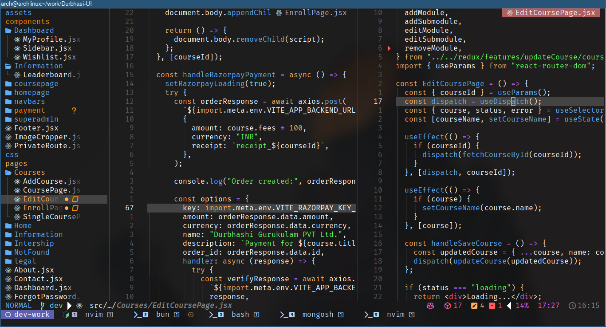
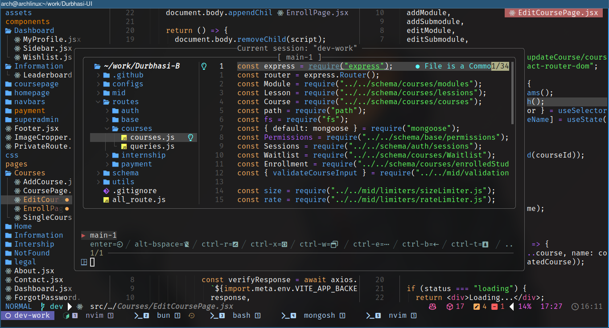
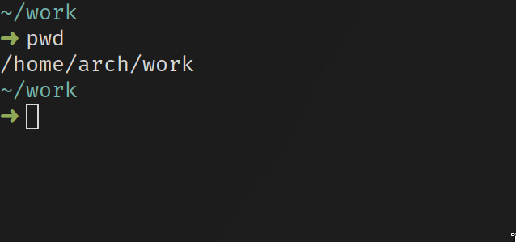
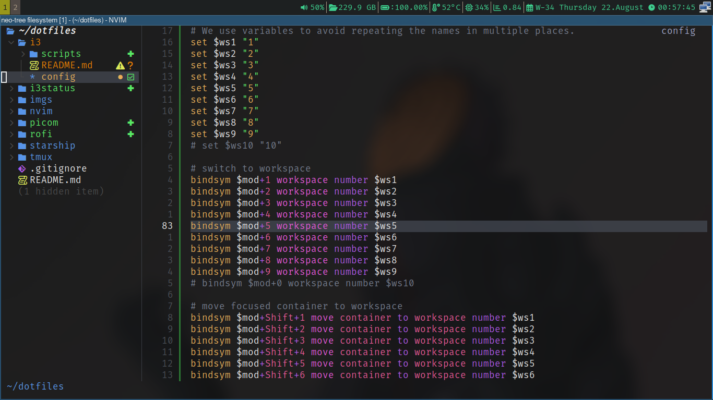

# dotfiles setup in arch based linux distro's

## NeoVim + Tmux + i3wm + Alacritty

NeoVim Preview


### 1. Install Arch Linux

[Arch Linux](https://archlinux.org/)

> [!NOTE]
>
> - Here is am using Arch with i3wm as my window manager.

### 2. Install git

```bash
  sudo pacman -S git
```

### 3. Install NeoVim

```bash
  sudo pacman -S neovim
```

### 4. Install & Setup Lazyvim

```bash
  git clone https://github.com/LazyVim/starter ~/.config/nvim

  rm -rf ~/.config/nvim/.git

  # launch nvim if required
  nvim
```

### 5. Install & Setup Tmux

```bash
  sudo pacman -S tmux
```

> [!IMPORTANT]
>
> - We will do `tmux` configs later.

### 6 Install treesitter & fzf & ripgrep for nvim

```bash
  sudo pacman -S tree-sitter fzf ripgrep
```

### 7. Clone this repository

```bash
  git clone https://github.com/sujit-shrc/dotfiles.git
```

### 8. Copy the neovim configs to the nvim folder

```bash
  cp -r dotfiles/nvim ~/.config/
```

### 9. Copy the tmux configs to the tmux folder

```bash
  cp -r dotfiles/tmux ~/.config/
```

### 10. Start Neovim to install plugins lazyvim does it automatically when you launch nvim

```bash
  nvim
```

> [!TIP]
> Awesome now your `nvim` is ready to use like an IDE.

### 11. Install lsp servers for your programming languages

```bash
  sudo pacman -S python-lsp-server typescript-language-server #or
  # open nvim, press `:` and type :TreeSitterInstall language_name
```

# Setting up `tmux` for multiple panes



[click Here for `tmux` configurations](./tmux/README.md)

# Setting up starship(rust based prompt) for minimalistic prompt



[click here for starship configurations](./starship/README.md)

# Setting up i3wm



[click here for i3wm configurations process](./i3/README.md)
